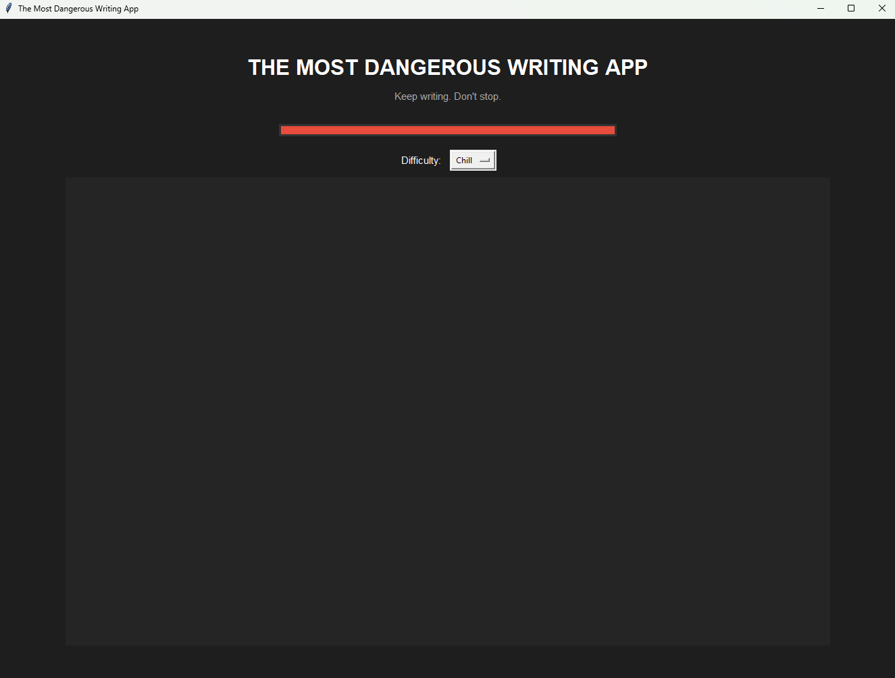

# The Most Dangerous Writing App ✍️

A desktop writing app inspired by [Dangerous Writing App](https://www.squibler.io/dangerous-writing-prompt-app).

The idea is simple: **keep writing or lose everything.**

If the user stops typing for a certain amount of time, all written text is automatically deleted.

## 📸 Screenshot

## ✨ Features

- ⏱️ Automatic countdown while writing
- 🗑️ Automatically deletes all text when the user stops typing
- 📊 Visual progress bar showing the remaining time
- 🎚️ Three difficulty levels:
  - **Chill** – 15 seconds
  - **Dangerous** – 10 seconds
  - **INSANE** – 5 seconds
- 🔄 Timer and progress bar reset every time the user types

## 🛠️ Technologies

- Python
- Tkinter
- ttk Progressbar
